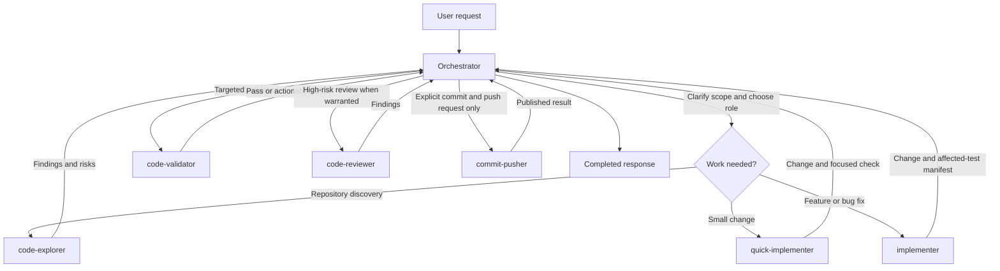

# Portable Codex subagents

This repository packages custom Codex subagent definitions and the routing rules
used by this setup. It contains no credentials, `config.toml`, or project data.

## Repository layout

- `agents/` — TOML definitions for the available custom agents.
- `rules/SUBAGENT_ROUTING.md` — delegation, ownership, validation, and role-selection rules.
- `templates/AGENTS.md.template` — a minimal manual global-instructions example.
- `install.sh` / `uninstall.sh` — guarded install and removal scripts.

## Subagent catalog

Use the exact agent name when delegating work.

| Agent | Model / effort | Primary responsibility |
| --- | --- | --- |
| `code-explorer` | GPT-5.6 Luna / medium | Read-only repository discovery and decision-ready findings. |
| `quick-implementer` | GPT-5.6 Luna / low | Small, well-scoped one- or two-file changes with focused checks. |
| `implementer` | GPT-5.6 Luna / high | Features and bug fixes, including targeted unit tests. |
| `code-validator` | GPT-5.4 Mini / low | Read-only, focused test, build, lint, or type-check verification. |
| `code-reviewer` | GPT-5.6 Sol / low | Read-only review for high-risk, public-API, or difficult changes. |
| `commit-pusher` | GPT-5.6 Luna / low | Intentional staging, conventional commit, and push—only on explicit request. |

## Orchestrator workflow

The orchestrator owns scope, integration, and the final outcome. Subagents own
bounded work; they share the same workspace and must preserve unrelated edits.



In brief, exploration and bounded implementation are delegated by default;
validation is separate from implementation; review is for high-risk or
difficult-to-validate changes; and commit/push is only used when explicitly
requested.

## Prerequisites and configuration

- POSIX `sh` and `python3`.
- Agent TOML files are validated with Python `tomllib` when available.
- Existing `config.toml` files that require parsing need Python 3.11+
  (`tomllib`) or the installable `tomli` package. A missing parser or malformed
  TOML stops installation before destinations are changed.

By default, files are installed under `$HOME/.codex`. Set `CODEX_HOME` to use a
different Codex home:

```sh
CODEX_HOME=/path/to/.codex ./install.sh
```

## Install

```sh
./install.sh
```

The installer copies agent definitions to `$CODEX_HOME/agents`, installs
`SUBAGENT_ROUTING.md`, and adds a managed import block to
`$CODEX_HOME/AGENTS.md`. It enables `[features.multi_agent_v2]` with
`hide_spawn_agent_metadata = false` and `tool_namespace = "agents"` only when
that table is not already defined. Existing files are backed up before being
replaced or modified. A state manifest at
`$CODEX_HOME/.subagents_configs-state.json` records ownership and hashes.

Re-running is safe: unchanged managed files remain unchanged, and stale package
files are removed or restored only when their installed bytes still match the
recorded hash. User-modified files are preserved. The installer does not rewrite
an existing multi-agent feature table.

## Uninstall

```sh
./uninstall.sh
```

Uninstall uses the state manifest to remove only package-owned files whose bytes
still match, restoring backups for replaced files. It removes only the exact
managed block from `AGENTS.md` (after making a backup), preserving surrounding
content and edits. The installer-added `config.toml` feature block is
intentionally left in place because ownership cannot be safely proven after
edits. If no valid state manifest exists, nothing is removed.

## Manual setup and verification

For a manual setup, copy the TOML files into `$CODEX_HOME/agents`, copy
`rules/SUBAGENT_ROUTING.md` to `$CODEX_HOME/SUBAGENT_ROUTING.md`, and add the
absolute-path import shown in `templates/AGENTS.md.template` to
`$CODEX_HOME/AGENTS.md`. Ensure the multi-agent feature table is present in
`$CODEX_HOME/config.toml` if your Codex installation requires it.

After installation, verify the output reports `TOML validation passed` (or the
documented validation skip), inspect the installed files under `$CODEX_HOME`,
and run the installer a second time to confirm it reports unchanged files.
